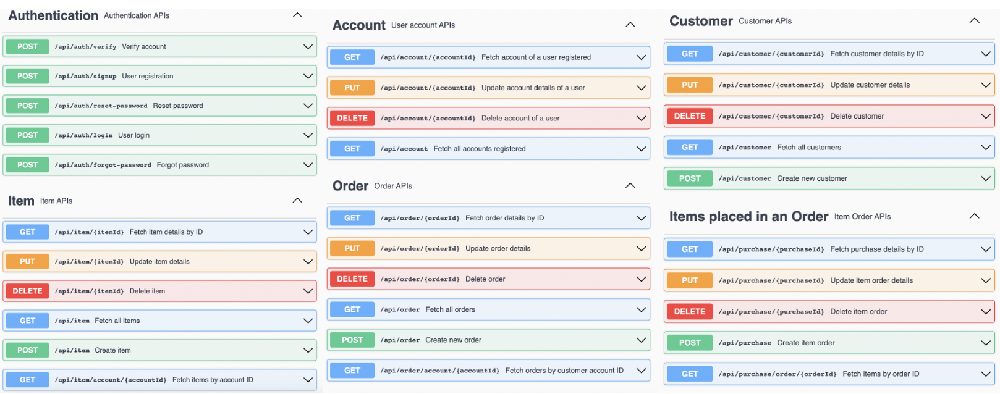
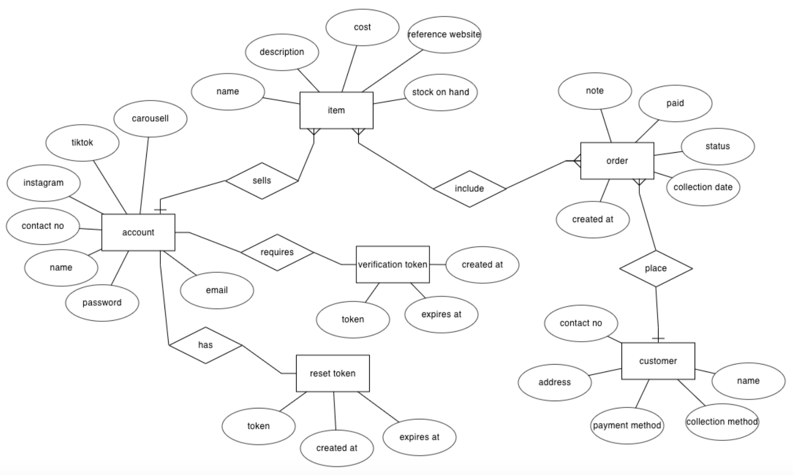
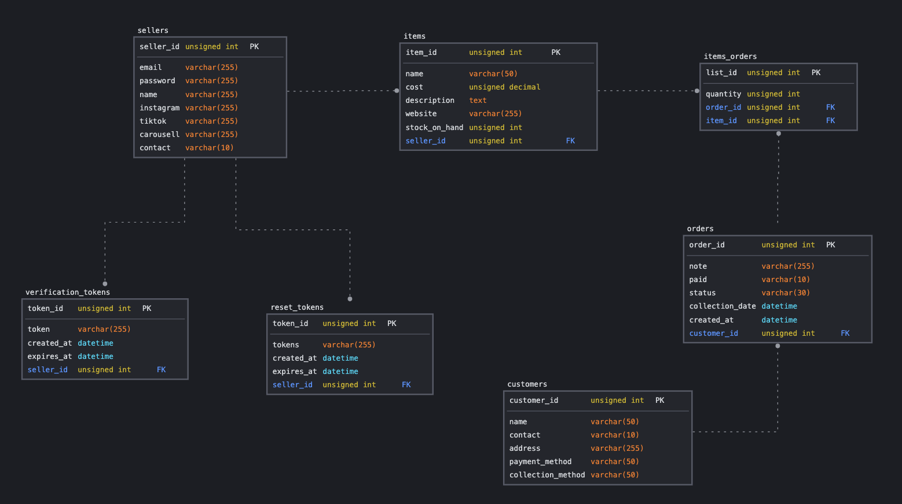

# Business Management System - Spring Boot Backend

## Project Introduction
This project aims to solve the pain points of small business owners by providing a system to keep track of customer orders. The Spring Boot backend integrates with the frontend and Telegram bot to provide a comprehensive solution for small business owners.

- GitHub Repository for Frontend (Angular): <a href="https://github.com/christiinelim/business-management-system">Link</a>
- GitHub Repository for Telegram Bot (NodeJS): <a href="https://github.com/christiinelim/bizorder-telegram">Link</a>

## Backend API Reference

### Endpoints

#### AccountController API Reference

| Endpoint                    | Method | Description                           | Request Body         | Response Body         |
|-----------------------------|--------|---------------------------------------|----------------------|-----------------------|
| /api/account                | GET    | Get all accounts                      | None                 | List of Account objects |
| /api/account/{accountId}    | GET    | Get account by ID                     | None                 | Account object        |
| /api/account/{accountId}    | PUT    | Update account                        | Account object       | Updated Account object |
| /api/account/{accountId}    | DELETE | Delete account                        | None                 | None                  |

#### AuthenticationController API Reference

| Endpoint                         | Method | Description                                | Request Body                 | Response Body           |
|----------------------------------|--------|--------------------------------------------|------------------------------|-------------------------|
| /api/auth/signup                 | POST   | Register a new user account                | Account object               | Verification message     |
| /api/auth/login                  | POST   | Log in an existing user                    | LoginAccountDto object       | Authentication token     |
| /api/auth/verify                 | POST   | Verify user account                        | VerifyAccountRequest object  | Verification message     |
| /api/auth/forgot-password        | POST   | Send reset email for forgotten password    | ForgotPasswordRequest object | Email confirmation      |
| /api/auth/reset-password         | POST   | Reset user password                        | ResetPasswordRequest object  | Password reset message  |

#### CustomerController API Reference

| Endpoint                    | Method | Description                            | Request Body    | Response Body           |
|-----------------------------|--------|----------------------------------------|-----------------|-------------------------|
| /api/customer/{customerId} | GET    | Get details of a specific customer     | N/A             | Customer details        |
| /api/customer/              | GET    | Get details of all customers           | N/A             | List of customers       |
| /api/customer/              | POST   | Create a new customer                  | Customer object | Success message         |
| /api/customer/{customerId} | PUT    | Update details of a specific customer  | Customer object | Success message         |
| /api/customer/{customerId} | DELETE | Delete a specific customer             | N/A             | Success message         |

#### ItemController API Reference

| Endpoint                          | Method | Description                               | Request Body | Response Body       |
|-----------------------------------|--------|-------------------------------------------|--------------|---------------------|
| /api/item/                        | GET    | Get details of all items                  | N/A          | List of items       |
| /api/item/{itemId}                | GET    | Get details of a specific item            | N/A          | Item details        |
| /api/item/account/{accountId}     | GET    | Get items associated with a specific account | N/A       | List of items       |
| /api/item/                        | POST   | Create a new item                         | Item object  | Success message     |
| /api/item/{itemId}                | PUT    | Update details of a specific item         | Item object  | Success message     |
| /api/item/{itemId}                | DELETE | Delete a specific item                    | N/A          | Success message     |

#### ItemOrderController API Reference

| Endpoint                      | Method | Description                               | Request Body | Response Body       |
|-------------------------------|--------|-------------------------------------------|--------------|---------------------|
| /api/purchase/{purchaseId}    | GET    | Get details of a specific purchase        | N/A          | Purchase details    |
| /api/purchase/order/{orderId} | GET    | Get items associated with a specific order | N/A          | Order details       |
| /api/purchase/                | POST   | Create a new purchase                     | Purchase object | Success message     |
| /api/purchase/{purchaseId}    | PUT    | Update details of a specific purchase     | Purchase object | Success message     |
| /api/purchase/{purchaseId}    | DELETE | Delete a specific purchase                | N/A          | Success message     |

#### OrderController API Reference

| Endpoint                      | Method | Description                                | Request Body | Response Body       |
|-------------------------------|--------|--------------------------------------------|--------------|---------------------|
| /api/order/                   | GET    | Get details of all orders                  | N/A          | List of orders      |
| /api/order/{orderId}         | GET    | Get details of a specific order            | N/A          | Order details       |
| /api/order/account/{accountId}| GET    | Get all orders associated with a customer  | N/A          | List of orders      |
| /api/order/                   | POST   | Create a new order                         | Order object | Success message     |
| /api/order/{orderId}         | PUT    | Update details of a specific order         | Order object | Success message     |
| /api/order/{orderId}         | DELETE | Delete a specific order                    | N/A          | Success message     |

<!-- ## Live Swagger UI
You can access the live Swagger UI [here](http://example.com/swagger-ui) to interact with the API visually. -->

### Swagger UI Screenshots

This screenshot shows the overview of the API endpoints and descriptions.

## ER Diagram

## SQL Schema

### License
This API is released under the MIT License. For support or feedback, contact us at bizordermanager@gmail.com.